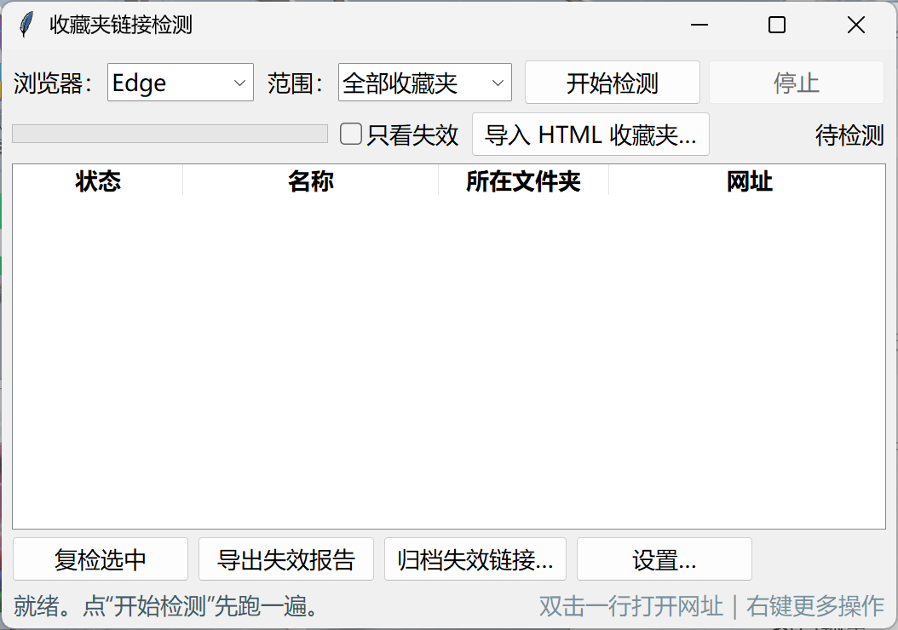

[**English**](README.md)

# 收藏夹链接检测工具 (Bookmark Link Checker) - 中文说明

绿色免安装的浏览器收藏夹失效链接检测工具，支持 Edge / Chrome，纯本地运行，不上传任何数据。支持 **Windows / macOS / Linux**。

## 界面截图



## 功能

- **一键检测**：自动读取 Edge / Chrome 收藏夹（或导入的 HTML 书签文件），32 线程并发检测，边检测边实时显示结果，不用等全部跑完
- **三档判定**：
  - 🔴 **确定失效**：页面 404、域名不存在、连接不上、证书打不开
  - 🟡 **疑似失效**：超时、服务器报错（可能是反爬拦截或网络波动，网页里可能能开）
  - ⚪ **能打开**：返回正常，或被网站拦截自动访问（403/401 等，链接本身正常）
- **导入 HTML 收藏夹**：支持浏览器导出的 bookmarks.html（嵌套文件夹 / UTF-8 / GBK 编码），导入后可单独检测
- **右键操作**（检测结果列表）：
  - 双击 / 右键「打开网址」→ 浏览器打开确认
  - 「删除该网址」→ 浏览器来源从收藏夹删除（自动备份）；HTML 来源同步从 HTML 文件删除
  - 「标记为正常」→ 误判时移出失效名单
- **一键归档**：把确定失效的链接移动到收藏夹的「失效链接归档」文件夹（改动前自动备份）
- **导出报告**：生成失效链接清单保存到桌面
- **复检选中**：对可疑链接单独重新检测
- **设置**：自定义报告和备份的保存位置

## 使用方法

**Windows**：从 [Releases](https://github.com/minglin190-lab/bookmark-link-checker/releases) 下载 `BookmarkChecker.exe`，双击即可使用，无需安装任何环境。

**macOS / Linux**：从源码运行（需 Python 3 + requests）：

```bash
git clone https://github.com/minglin190-lab/bookmark-link-checker.git
cd bookmark-link-checker
pip install requests
python gui.py
```

**自行打包**（Windows，需 PyInstaller）：

```bash
pyinstaller --noconfirm --onefile --windowed --icon icon.ico --name BookmarkChecker gui.py
```

## 判定逻辑说明

工具通过 HTTP 请求判断网址是否可访问，并做了针对误判的加固：

- 域名是否存在会做**独立 DNS 二次校验**（`socket.getaddrinfo`），避免网络抖动误杀
- 连接失败时先试 HEAD 请求、再试长超时 GET，**反爬网站切断脚本请求**不会被直接判死
- 超时、服务器报错等**不可靠信号一律归为"疑似"**（黄色），不标死
- 只有 404 和域名确认不存在等**可靠信号**才标"确定失效"（红色）

**局限**：工具只能检测"网址通不通"，无法判断"内容是否变质"（如网站还在但内容已删除、域名到期变成广告页等），这类需要人工点开确认。检测依赖网络环境，少数情况下可能有误判，以人工确认结果为准。

## 隐私说明

- 完全本地运行，收藏夹数据不上传任何服务器
- 备份文件保存在 `我的文档\收藏夹链接检测备份`（可在设置中修改）
- 报告默认保存到桌面（可在设置中修改）

## 开源协议

[MIT License](LICENSE)
